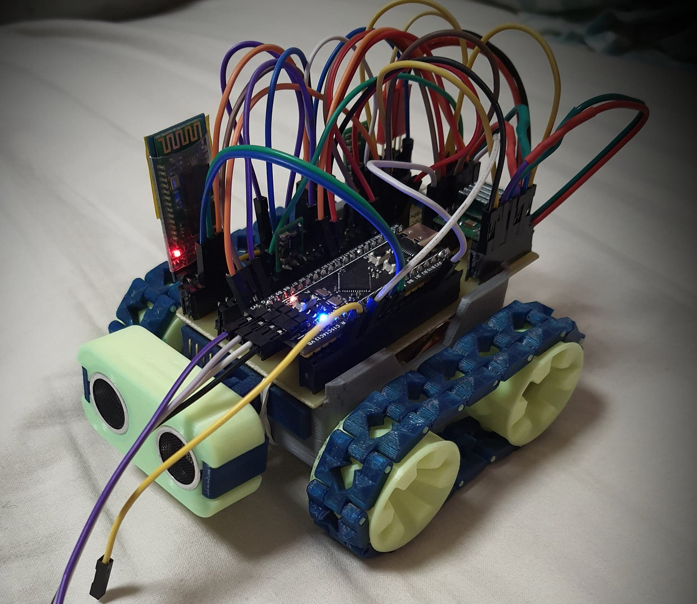
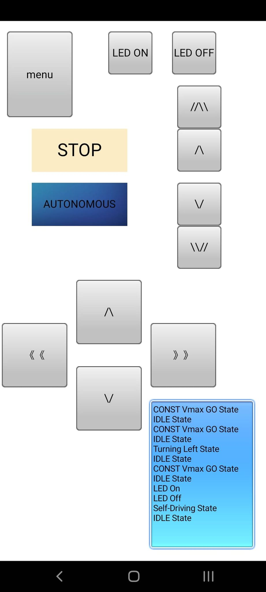
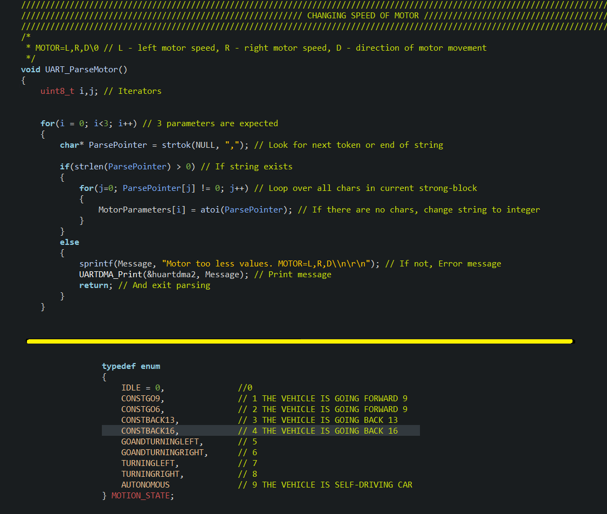

# STMars Modular Robot
>My version of popular SMARS project, but THIS is distinguished by the fact that it is on STM32F411.

## Table of contents
* [General info](#general-info)
* [Screenshots](#screenshots)
* [Technologies](#technologies)
* [Features](#features)
* [Status](#status)
* [Inspiration](#inspiration)
* [Contact](#contact)

## General info
It is educational SMARS project based on STM32 BlackPill. I created this project to learn how to develop projects on STM32 and how to use my own 3D Printer.

STMars has two modes of working, the first one is remote control via Bluetooth, using a phone and HC-05 module, second mode is the ability to drive autonomously and avoid obstacles.

## Screenshots

## Technologies
C,
HAL for STM32F4
Low-Layer drivers

STM32CubeIDE,
RoboRemo

## Code Examples

## Features
UART in DMA mode,
State machine.

## To-do list
Upgrade standalone mode.
Add calibration of engine speed by optocoupler

## Status
Project is in progress and i will develop them to learn ARM and STM32.

## Inspiration
It will be added.

## Contact
Created by https://www.linkedin.com/in/kamil-gradowski-8706991aa - feel free to contact me!
grados73
